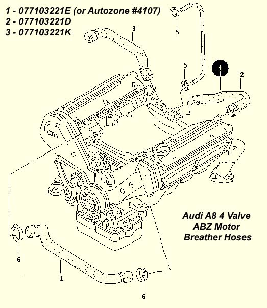
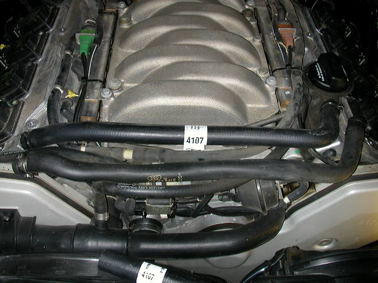

# Breather Hose Replacement

:::info
The front and rear breather hoses deteriorate over time on the Audi A8 32 valve ABZ engine.
:::

The replacement hoses are $40-$50 each from the dealer, but the front can be easily replaced with an equivalent Autozone (part number L4107), or Advanced Auto Parts (part number 80414, UPC 0 38244 11112 1) replacement. They are about $6 from these sources.

:::tip
The front breather hose can be replaced with Autozone L4107 or Advanced Auto Parts 80414.
:::

> Hose installed. The hose requires a small section to be removed from each end for a proper fit. Factory pinch clamps are not used because the outside diameter of the hose is slightly larger than OEM. Use tie wraps or standard hose clamps instead.

**Source: [www.audipages.com](http://www.audipages.com/Tech_Articles/enginemechanical/breatherhose.html)**