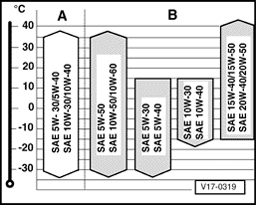
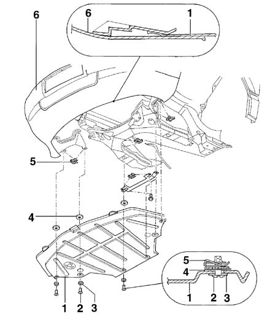
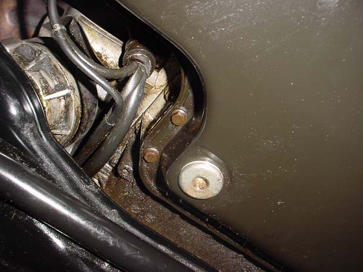
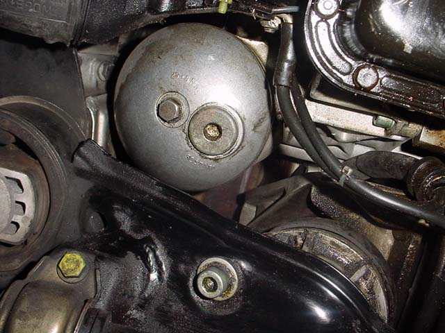
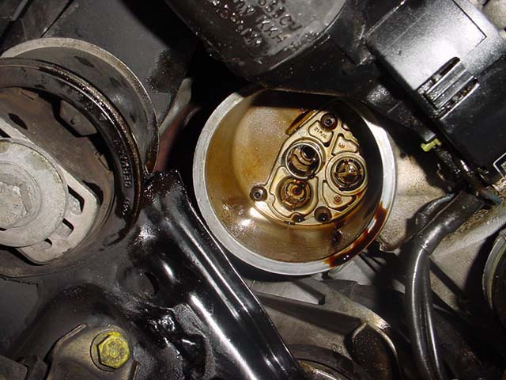
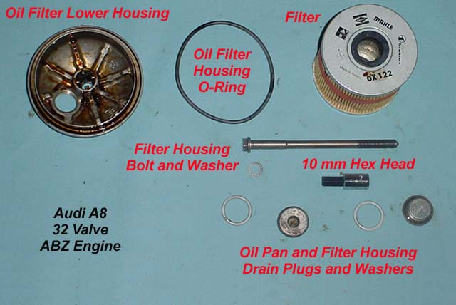

# Changing the Oil and Filter

### Oil and Filter Change Intervals

Audi recommends changing the oil and filter on the A8 32 valve engine every 7,500 miles and every 15,000 miles for the filter. The 40 valve motors found on the 2000 and newer models have an oil change frequency of 10,000 miles and filter every 20,000 miles. 

:::tip
Audipages recommends changing the oil filter when changing the oil and changing it every 7,500 to 10,000 miles.
:::

### Type and Viscosity of Oil

There are many types and viscosity of oil. Audipages recommends using synthetic oil in your engine. There are many different views on this subject, use a quality oil of your favorite type, synthetic is not a requirement. The following chart outlines the recommended viscosity of oil.

### Tools and Supplies Required for 32 Valve Motor

 - Stubby regular screwdriver
 - 10 mm hex head
 - 13 mm socket and extension
 - Large oil drain pan
 - Ramps or jack stands
 - Surgical gloves (wear two pairs)
 - Shop paper towels
 - Oil filter kit (ebay or dealer item)
 - 8 quarts of oil 

### Tools and Supplies Required for 40 Valve Motor

 - Stubby regular screwdriver
 - 10 mm hex head
 - 6 mm hex head
 - 36 mm socket
 - Large oil drain pan
 - Ramps or jack stands
 - Surgical gloves (wear two pairs)
 - Shop paper towels
 - Oil filter kit (ebay or dealer item)
 - 8 quarts of oil 

## Changing the Oil and Filter

:::tip
Raise the front end of the car by driving it up on ramps (Rhinoramps are great, and only $20.00) or using a jack and jack stands. Raise the whole front end off the ground. If you don't, it makes removing and installing the belly pan very difficult.
:::

Ensure your car is operated before starting the oil change. This allows the engine oil to flow freely and pick up any solids that may be at the bottom of the pan.

### Remove the belly pan using a flat tip stubby screwdriver

**There are a total of 10 fasteners:**

 - 2 half turn plastic type at front of belly pan/bumper
 - 2 screw in metal type at front of belly pan just aft of bumper
 - 2 screw in metal type at rear end of belly pan
 - 2 half turn plastic type at right hand wheel well
 - 2 half turn plastic type at left hand wheel well 

> Remove the belly pan. How many fasteners did your car have? Make a note of what's missing and replace it next time.

### Drain the oil

Make sure you have a LARGE drain pan, one of at least 12 quarts. There is 8 quarts of oil in the pan and it drains out fast! Place the pan under the car and using the 10 mm hex head, unscrew the oil pan drain plug and let the oil drain out. You can put your finger over the hole if you have two pairs of surgeon's gloves on to slow the flow down during the initial stages. It is also a good idea to place a large piece of cardboard on the floor below the drain pan to catch the splashing oil.

> Oil pan drain plug. It is a 10 mm hex head.

### Oil filter

After the oil has drained, remove the oil filter housing 10 mm hex head drain plug. Let the oil filter housing drain. Using a 13 mm socket, unbolt the oil filter housing lower cover. Drop the bolt out. To remove the filter housing lower cover, stick your hand up to hold the filter in place, and wiggle just the cover out. By holding the filter up in place, it allows more room for the lower housing cover to maneuver out. Once the lower housing cover is removed, remove the oil filter.

> Oil filter housing lower cover with 10 mm hex head drain and 13 mm attachment bolt.

> Oil filter housing lower cover with 10 mm hex head drain and 13 mm attachment bolt.

### Reassembly

:::tip
After the oil has drained out, clean the housing, housing bolt and drain plugs. 
:::

Using the filter and new crush washers supplied in the filter kit, put everything back together again. The oil filter kit comes with the oil filter, oil filter housing o-ring, 13 mm bolt washer and two drain plug washers.

> Torque the 13 mm bolt to 18 lb-ft, the 10 mm hex head drain plugs to 26 lb-ft.

When reassembling, lubricate the lower housing o-ring with fresh engine oil and install. Torque the lower housing bolt to 18 lb-ft of torque, and the 10 mm drain plus to 26 lb-ft of torque.

Fill the engine with 7 quarts of oil. Start the car and let idle 1-2 minutes. Check for leaks. Install the belly pan. Drive the car off the ramps or lower with a jack.

With the car on level ground, check the oil level and add to the full mark. Reset the oil indicator light using your ross-tech software if you have it! 

**Source:** [www.audipages.com](http://www.audipages.com/Tech_Articles/enginemechanical/oilchange.html)

**Author:** Paul Waterloo