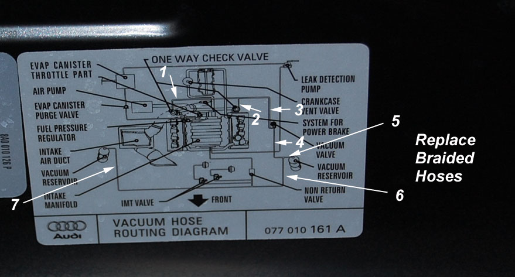
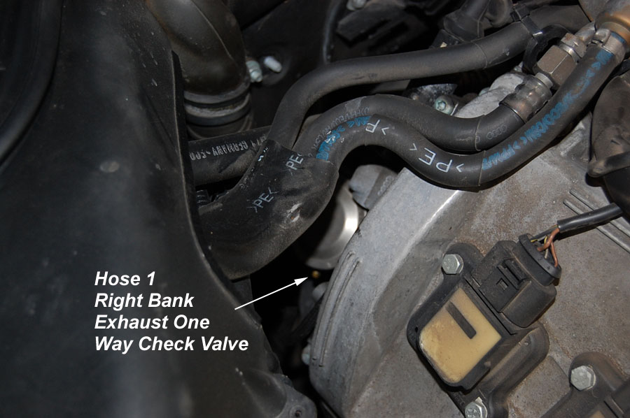
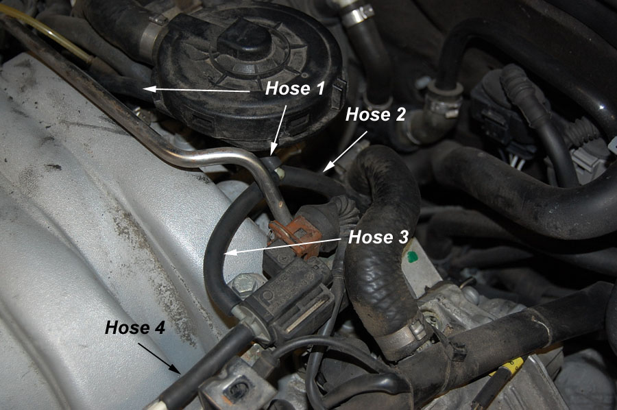
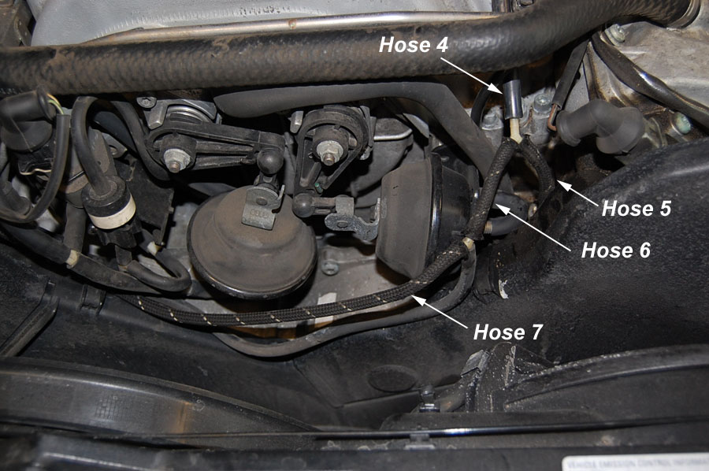
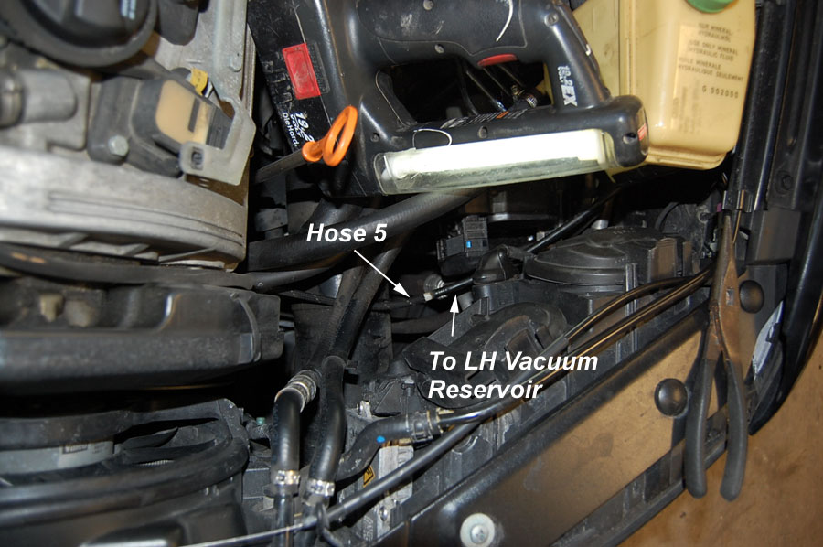
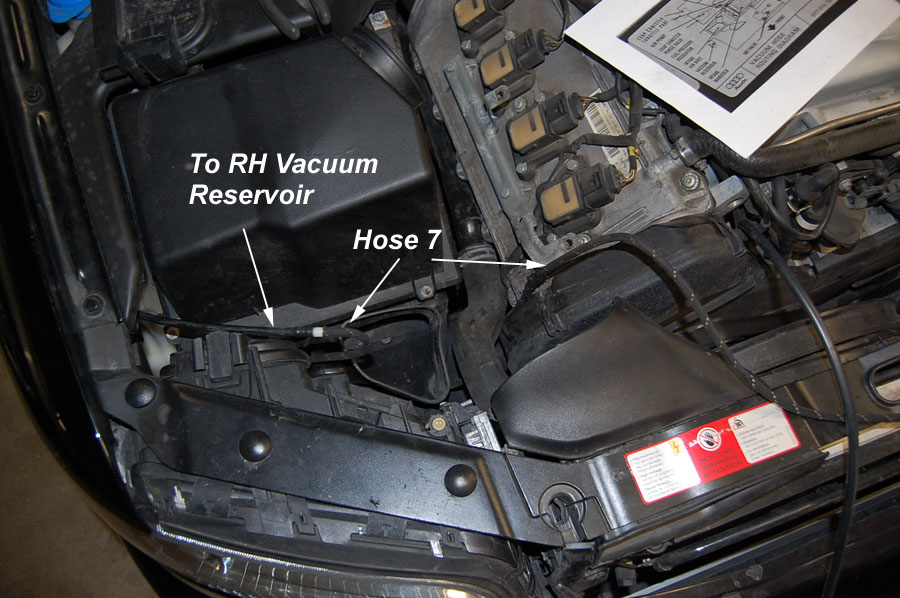

# Vacuum Hose Replacement

If you have a D2 A8 with a 40 valve motor and are reading this, you will need to replace your braided vacuum hoses if you haven't already. My 8 year old S8 with 84K miles had vacuum hoses that crumbled in my hands. The good news is that it is cheap and easy. An hour and $15.00 is probably all that you will need. 

### Tools and Supplies Required

 - 15 Feet of 5/32" Vacuum Hose - Get at any parts store (you'll have left over)
 - Something to cut the Vacuum Hose
 - Regular and Phillips Head Screwdriver 

### Procedure

This procedure is self explanatory. You will need to remove the engine beauty covers, the air intake from the air box to the throttle plate to get access to hose number 1, and also the cold air intake going into the air box. But other than that, just follow the pictures. I worked in the order of the hose numbers below. 

I believe this covers all the braided hoses, the other hoses are larger or the same diameter but not braided and did not appear to be failing in any way. You would also want to do this if you have Fault Code 17831 17819 - Sec. Air Inj. Sys: Bank 2: Flow too Low. `TODO: MISSING LINK`

> Vacuum hose routing diagram sticker from under the hood. The braided hoses are denoted in the picture and then shown on the engine below. It's not that obvious until you study the diagram.

> Vacuum hose 1 goes to the right hand side "one way check valve". Hose 2 goes to the left hand side. This is part of the cold air start emissions equipment. To learn more about this system, read this. `TODO: MISSING LINK`

> The picture above is the back left side of the motor.

> The picture above is the front of the motor.

> The picture above is the left side of the motor, note headlight assembly.

> The picture above is the right side of the motor, note headlight assembly.

**Source:** [www.audipages.com](http://www.audipages.com/Tech_Articles/enginemechanical/vacuumhosereplace.html)

**Author:** Paul Waterloo