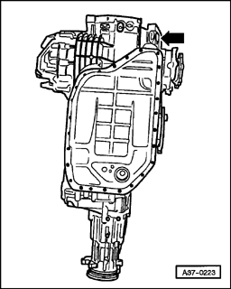
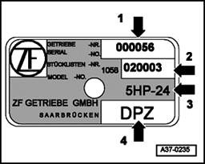
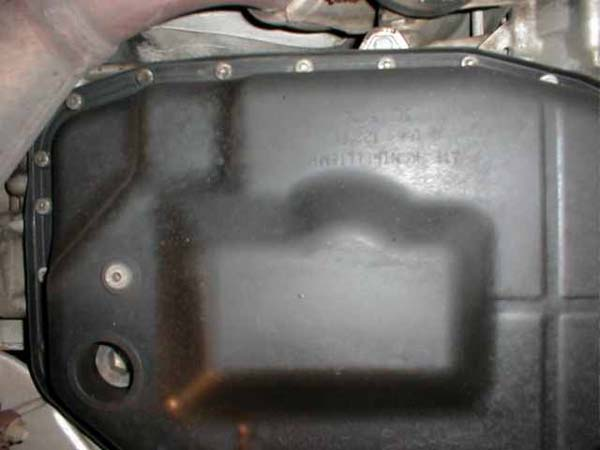
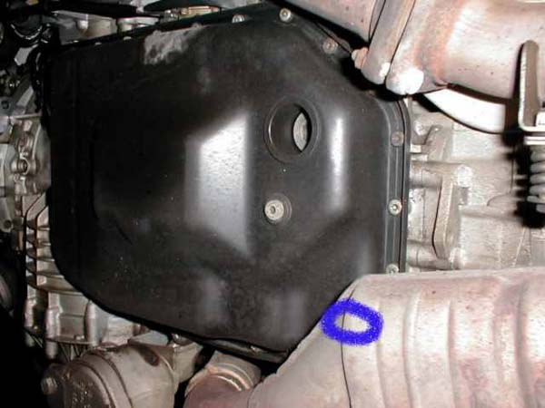
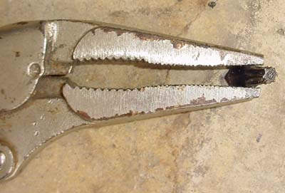
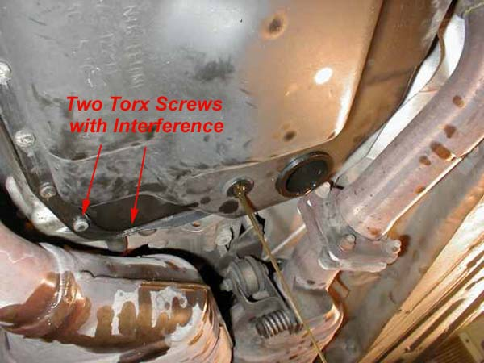
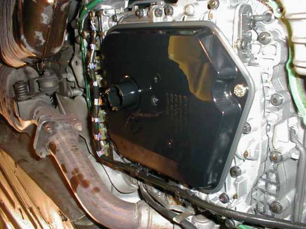
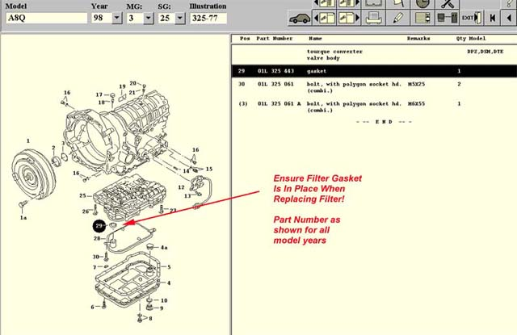
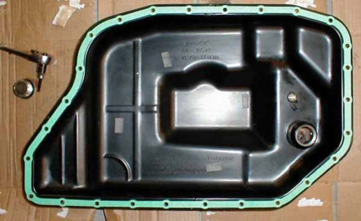

# Oil and Filter service (5-speed)

:::tip Background
Changing the transmission fluid and filter is probably the **MOST IMPORTANT** service that you can perform on your A8.
The transmission has metallic wear components. Once these wear, the filter clogs up and the oil is degraded over time.
This starves the hydraulic pump of oil, especially on cold start ups and causes the pump to cavitate. This is the
squealing noise that can be heard. This can cause long term damage to the transmission.

Audi states the automatic transmission fluid (ATF) is a lifetime fluid. This is not true. It is recommended to change
the fluid and filter every 25,000 to 40,000 miles. This can save over $8,000 for a rebuilt transmission.
:::

## Preparation

### Transmission nameplate location

:::note Nameplate explanation

1. Transmission serial number
2. Transmission serial number
3. Transmission identification (all will be 5HP-24)
4. Code letters
   :::

### Parts needed

- `01L-325-429-A` Filter (see note below)
- `01L-325-443` Filter to Transmission Gasket/O-Ring
- `01L-321-371` Pan Gasket
- `01V-321-379` Fill Plug Sealing Washer
- `G-052-162-A2` ATF Fluid (have 8-9 quarts on hand, you might use a little less), use ONLY Audi fluid

:::note
`01L-325-429` is the filter part number for model year 1997 A8's that came with a type `DPZ` transmission with a serial
number of 001891 or less.

`01L-325-429-A` is for all 1997 A8's with `DPZ` transmissions with serial numbers greater than 001892, `DSM` type
transmissions and `DTE` transmissions. The `DTE` transmission was supplied on later 97's and all 98-03 A8's.
:::

### Tools needed

- Torx T-27 bit, it will have to be ground down
- Socketed Torx T-27
- Screwdriver type Torx T-25
- "L" shaped 17mm allen wrench
- Oil pump

## Procedure

:::warning important
**The car should be level** for this procedure. If not, **you can't properly fill the transmission**. Put the car up on
four
jack stands if you don't
have your own lift.
:::

### 1. Open drain plug and let fluid drain

:::tip
Make sure you can loosen the two obstructed bolts before you drain the fluid described in the 2nd step
:::

> This is the transmission pan. The small bolt is the drain, the large one is the fill. The bolts are Torx bolts, size
> T-27.

The fill plug is a 17mm Allen. Make sure you can remove the fill plug before you open the drain plug. You don't want to
drain the fluid, then find that you can't fill it! I tried using two 17mm nuts welded to a bolt with a 17mm head. No
good. The fill plug took a lot of torque to loosen. I had to buy a 17mm L shaped allen for $9.00. I put a 2' pipe on the
end and it came right out.

Be prepared for about 6-7 quarts to drain. Note that the Audi fluid is not red like every other transmission fluid. It's
sort of yellowish green. Mine was in much better condition than I anticipated. It was still clear, not burnt and did not
smell rancid or overheated.

I was surprised that when I removed the fill plug, a lot of fluid came pouring out. Fortunately I had the drain pan
positioned. I learned that when the engine is running, a few quarts of fluid get sucked out of the pan into the
transmission.

### 2. Remove transmission pan bolts and remove pan

> Obstructed bolt locations are highlighted with the blue circle

Of course, nothing can be easy. Note that two bolts are obstructed by the catalytic converter. You could remove the
exhaust, but that would be a real pain. Instead, buy a Torx T-27 bit, grind off about 1/4" off the back side.
Lock it into a vise grips, and you can use that to loosen the two bolts. I also recommend you have a socketed T-27, and
a screwdriver type T-25. You can use the T-25 to remove the two obstructed bolts. The smaller tool allows you a better
angle into the bolt. Be careful to not damage the bolt head too much.

> Ground down T-27 bit in vice grips. This will allow you to get the two hidden T-27 screws out without dropping the
> exhaust.

### 3. Remove filter (screen) bolts and remove old filter and install new filter

The filter is still bolted to the transmission with two bolts. Remove them and it comes down. Note that there is a
rubber o ring on the output of the filter. Note that those two bolts are different than the trans-pan bolts (shallower
head).

:::warning important
When installing new filter, make sure the filter to transmission gasket/o-ring is in place!
:::

### 4. Install transmission pan

> Clean pan, drain bolt installed, gasket placed. I use a dab of vaseline to hold the gasket in position until it can be
> bolted in place.

Position the pan and bolt it in with three bolts. Make sure the gasket is properly positioned and insert the rest of the
bolts finger tight. Then use a cross type pattern to tighten each bolt to 7-9 ft. lbs. You won't be able to torque the
two bolts above the catalytic converter, so just make those snug.

### 5. Add new fluid

:::info
This is the **MOST CRITICAL** part of this procedure. Now came the hard part, filling the fluid.
:::

:::warning very important
The car must be at ambient (cool) temperature before filling the transmission! This requires the car to sit overnight to
completely cool off.
:::

1. Fill the pan with as much fluid as you can with the car off (until it starts flowing out of fill hole)
2. Start the car. Right away it will start taking more, give it about 20-30 seconds to start pumping fluid through the
   tranny
3. Keep filling until it overflows. Should be 2-3 more quarts (initial fill about 4 quarts)
4. Have somebody run through all the gears for 30 seconds each (with the brake on), when doing reverse, the fluid will
   flow out, let it, then go through N,D,4,3,2 30 seconds each. This is about 10-15 minutes into the fill after the car
   started
5. Let the car run another 2 minutes, then run it through all gears for 30 seconds again, do Reverse for a shorter time
   because it will squirt out
6. Keep filling so it has a slight overflow at all times

> If you have the Ross-Tech software, monitor ATF fluid temperature on group number 4, under measuring blocks,
> transmission module. The temperature of the ATF fluid during this procedure should be 30-45 C. If the engine is
> operated
> for about 15 minutes from ambient temperature, it will reach somewhere around 45 C at the end of the 15 minutes. This
> is
> why the car must be cooled overnight. If you do not have the software, just ensure it was cooled overnight. It is not
> absolutely critical to measure ATF fluid temperature. However, you **CANNOT** do this if the transmission is not at
> ambient
> at the beginning of the fill.

You'll need a total of 8 quarts of ATF on hand, I would have 9 there in case you spill one...you just might.

:::info BEFORE TURNING OFF THE CAR
Put the stand pipe plug in (fill plug). Turn off car. The procedure is complete. Test drive
it for a few days, if anything does not sound correct, check level again. However, your transmission should be operating
significantly smoother. There is no need to check the level again if there is nothing wrong with the transmission.
:::

**Source:** [www.audipages.com](http://www.audipages.com/Tech_Articles/auto_transmission/autotranservicing.html)

**Author:** Barry Lenoble and Paul Waterloo
